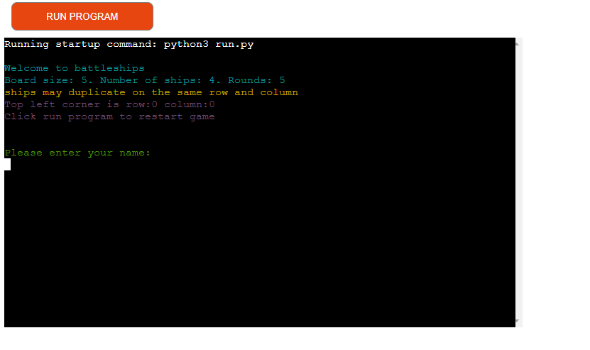
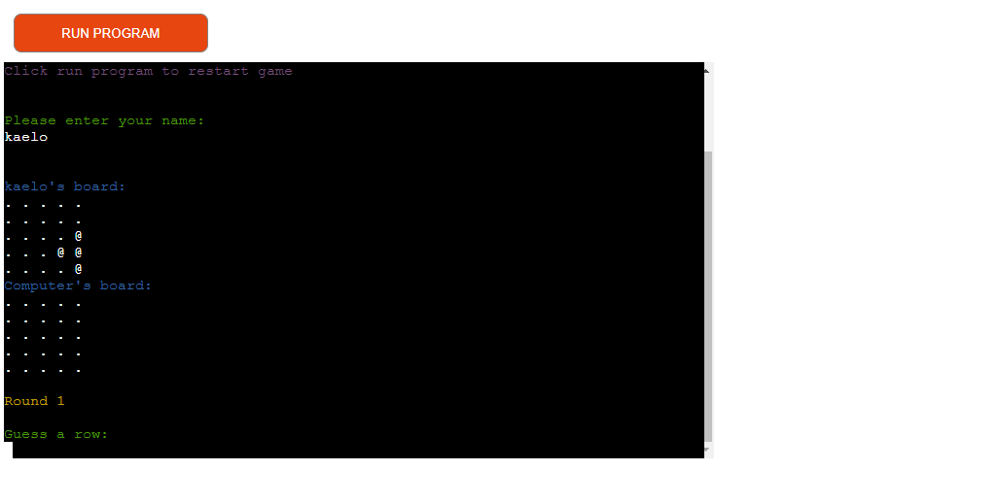
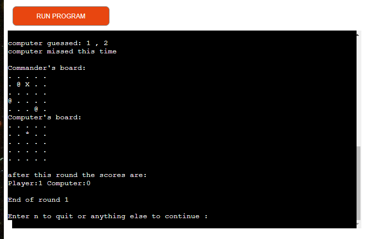

# Battleships game

This is a website that lets a user play a game of battleships against a computer

## Contents

* Goals
    * Owner goals
    * User goals

* Layout/Structure
    * Different parts of the game
    * Flowchart

* Features

* Technologies

* Testing 

* Issues

* Deployment

* Credits

## Goals

### Owner goals

- Make a battleships game in python, test my skills as a programmer and provide a fun
, interactive chance based game.

### User goals

- Play a fun interactive chance based game, be aware of their progress and be able to
quit and restart the game at their own discretion.

## Layout/Structure

### Start

- When the user starts the game the number of rounds, ships and the board size is 
displayed to them.
- After that they are prompted to enter their name.

### Name entered

- After the user enters their name their board and the computers board is printed.
- They are then prompted to guess a row and a column.

### After guess

- After the player guesses a row and a column the program displays where the player
guessed and if they scored a hit then it does the same for the computer.
- Then it prints the player and computer's board it marks a miss on the board with
X and a hit with *.
- Then it asks the player if they would like to continue playing or quit .
- If they quit the game ends and the score is displayed, if they continue the user.
is prompted to guess an row and a column again and the same thing happens until 
they have played 5 rounds when they have played 5 rounds the game ends.

### Flowchart

- Above is a flowchart that I made in lucidchart to help me plan out my project.

## Features

The game allows the user to: 
- Enter their name 
- Keep playing, quit or restart whenever they want

The game provides feedback in the form:
- Of telling the user if input is valid
- Displaying the score after a round is played
- Marking the board with an X where there was a guess that missed
- Marking the board with an asterisk where there was a hit

It provides valuable information in the start screen such as:
- The number of ships 
- The board size
- The number of ships
- How to restart the game
- The fact that some ships may be duplicated

## Missing features

If I had more time I would have:
- Found a way to add make the terminal text colored
- Found a way to stop ships from being duplicated
