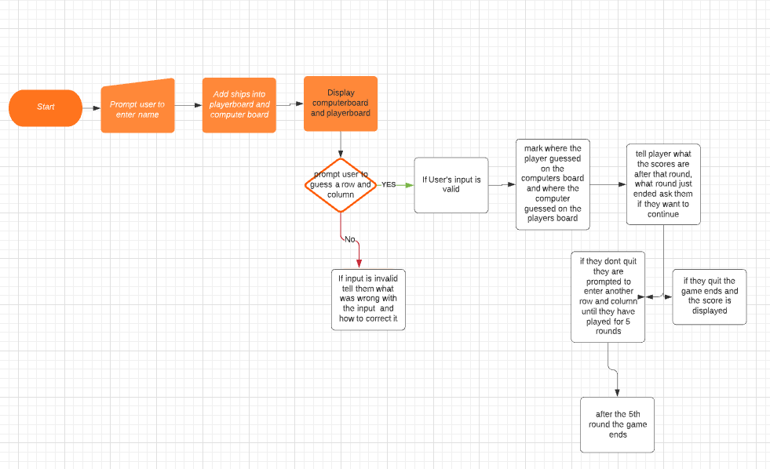

# Battleships game

This is a website that lets a user play a game of battleships against a computer

## Contents

* Owner goals

* User goals

* Layout

* Features

* Structure
    * Flowchart
    * Detailed explanation

* Technologies

* Testing 

* Issues

* Deployment

* Credits

# Goals

## Owner goals

- Make a battleships game in python, test my skills as a programmer and provide a fun
, interactive chance based game.

## User goals

- Play a fun interactive chance based game, be aware of their progress and be able to
quit and restart the game at their own discretion.

# Layout

### Start

- When the user starts the game the number of rounds, ships and the board size is 
displayed to them.
- After that they are prompted to enter their name

### Name entered

- After the user enters their name their board and the computers board is printed
- They are then prompted to guess a row and a column

### After guess

- After the player guesses a row and a column the program displays where the player
guessed and if they scored a hit then it does the same for the computer
- Then it prints the player and computer's board it marks a miss on the board with
X and a hit with *
- Then it asks the player if they would like to continue playing or quit 
- If they quit the game ends and the score is displayed, if they continue the user
is prompted to guess an row and a column again and the same thing happens until 
they have played 5 rounds when they have played 5 rounds the game ends.

### Flowchart

- Above is a flowchart that I made in lucidchart to help me plan out my project
